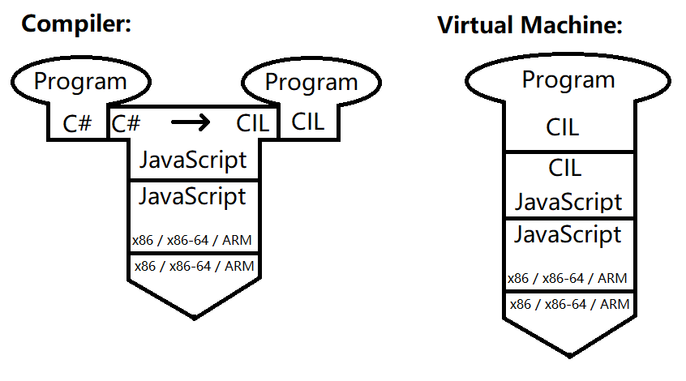
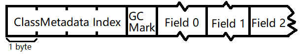
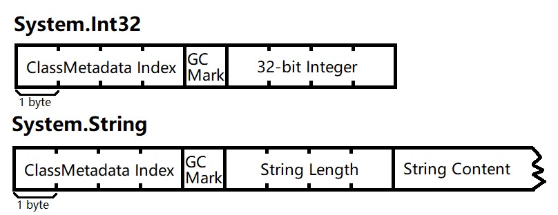

# Overview
This is an interpreter for a **sublanguage of C#**[<sup>1</sup>](#overview-remarks) written in TypeScript. The project consists two major parts:

 - A **compiler** that can compile C# into a **sublanguage of Common Intermediate Language (CIL)**[<sup>2</sup>](#overview-remarks)
  - A **virtual machine** for running the compiled CIL code

**T-Diagram of this project**:



<div id="overview-remarks"><div>

  ## Remarks
  - [1] For short, I'll call the sublanguage of C# directly as "C#" in the following report context.
  - [2] For short, I'll call the sublanguage of CIL directly as "CIL" in the following report context.

# Specification
 ## Overall
   - Supports namespaces and classes
   - Supports class fields, static methods and instance methods
   - Supports (partial) built-in C# types and core libraries
 ## Compiler
  - Lexer and parser written in and built with [ANTLR](https://www.antlr.org)
  - Namespace and class compiler
    - Namespace definition compiler
    - Class definition compiler
      - Class field definition compiler
      - Class method definition compiler (method signature)
    - Inheritence tree, field inheritence and method table
    - Compile-time type matching (matching type name strings to compiled `ClassMetadata` Javascript objects)
  - Method body compiler (C# to CIL)
  - Compile-time error reporting (partial)
 ## Virtual Machine
  - Abilities to run various CIL instructions from the compiler
  - Call stack, evaluation (operand) stack
  - Heap
    - [Memory Heap](#details-virtual_machine-memory_heap) (Abstraction of `Uint8Array`)
    - [Object Heap](#details-virtual_machine-object_heap) (Abstraction of `MemoryHeap`)
  - Garbage collector (Mark-and-Sweep)


# Details
  ## Compiler
  ### Compilation Steps
  These are the major steps to compile the raw C# source code strings to metadata objects that will be used in the virtual machine.
   - When a new code piece is added to the program, the compiler will first parse the code to an ANTLR parse tree, then build namespace tree structure and create primary `ClassMetadata` objects based on the parse tree.
   - After all code pieces of the program have been added, the compiler will match type specifiers (type name, or type name and type path) outside method bodies (for example, type specifiers that specify the base class of a class) to the corresponding `ClassMetadata`.
   - Then, the compiler will calculate field sizes[<sup>1</sup>](#details-compiler-compilation_steps-remarks) and field offsets[<sup>2</sup>](#details-compiler-compilation_steps-remarks), check for duplicated field names and duplicated method signatures for each `ClassMetadata`.
   - Then, the compiler will generate the inheritance tree for all classes.
   - Then, the compiler will start processing inheritance information. This includes appending inherited fields from base classes to subclasses and generating method table (where method overriding relationships will be processed).
   - Then, the compiler will compile C# codes (in the form of ANTLR parse tree) in method bodies to CIL instructions.
   - Finally, the compiler will prepare some cached mapping for primitive types. After this final step, the whole compilation process is finished, and the compiled data is ready for the virtual machine to use and run.

   Except the first step, other steps are called in a sequence by `compile()` function in `CSharpProgram.ts` [(view source)](https://github.com/source-academy/csharp-slang/blob/main/src/common/compileTime/CSharpProgram.ts).

   <div id="details-compiler-compilation_steps-remarks"><div>

   #### Remarks
   - [1] Actually, all fields have a size of 4 bytes, since in the virtual machine all fields are addresses.
   - [2] In this step, the compiler only consider the fields defined directly in the current `ClassMetadata`, but no inherited fields from base classes. Inherited fields will be processes in a later step.


   ### Metadata
   The compilation results from the compiler is made up of **metadata** (Javascript objects for storing program information that the virtual machine can use and run the program.) Here are a brief description of what information is stored in each kind of metadata. [(view source folder)](https://github.com/source-academy/csharp-slang/tree/main/src/common/compileTime/metadata)

  #### `MetadataStorage` [(view source)](https://github.com/source-academy/csharp-slang/blob/main/src/common/compileTime/metadata/MetadataStorage.ts)
   - It stores `rootNamespace`, the (internal) root namespace for the whole program.
  #### `NamespaceMetadata` [(view source)](https://github.com/source-academy/csharp-slang/blob/main/src/common/compileTime/metadata/NamespaceMetadata.ts)
   It stores the information that can be used to describe a namespace. It stores:
   - the name of the namespace;
   - the child namespaces of the namespace (as `NamespaceMetadata`);
   - the classes directly in the namespace (as `ClassMetadata`).
  #### `ClassMetadata` [(view source)](https://github.com/source-academy/csharp-slang/blob/main/src/common/compileTime/metadata/ClassMetadata.ts)
  It stores the information that can be used to describe a class. It stores:
  - the name of the class, the base (parent) class of the class (in a `TypeSpecifier`);
  - the fields (including inherited fields) in the class (as `FieldMetadata`);
  - the method table of the class (including all methods that can be statically called with the class name or called on an instance object of the class. Specifically, they are static methods, constructors, inherited (and not overrided) instance methods, overriding instance methods and instance methods with no overriding relationship.);
  - `sizeOfObjectFields`, the total size (in bytes) of all fields in the runtime object of this class;
  - `classMetadataIndex`, the unique index of the `ClassMetadata` in the whole program, which is used for identifying the class of an object during runtime in the virtual machine.
  #### `FieldMetadata` [(view source)](https://github.com/source-academy/csharp-slang/blob/main/src/common/compileTime/metadata/FieldMetadata.ts)
  It stores the information that can be used to describe a field in a class. It stores:
   - `fieldType`, the type of the field (as a `TypeSpecifier`);
   - `fieldName`, the name of the field;
   - `fieldSize`, the size of the field (in bytes);
   - `fieldOffset`, the offset of the field in the runtime object, excluding the object header (The first field in the object will have a `fieldOffset` equals to zero).
   #### `MethodMetadata` and `ImplementedMethodMetadata` [(view source)](https://github.com/source-academy/csharp-slang/blob/main/src/common/compileTime/metadata/MethodMetadata.ts)
   `MethodMetadata` stores the information that can be used to describe a method declaration, and `ImplementedMethodMetadata` stores the information that can be used to describe a method with declaration and body.<br>
   `MethodMetadata` stores:
   - `modifiers`, an array of the method modifiers for this method
   - `methodSignature`, the method signature of this method
   - `returnType`, the return type of this method.
   - `isStatic`, represents whether the method a static method or not.

  `ImplementedMethodMetadata` extends from `MethodMetadata`, and it additionally stores:
   - `methodBody`, the body of the method.
  


  ## Virtual Machine

  ### Virtual Machine Structure
  The virtual machine mainly consists three parts:
   - The **evaluation stack**, which stores the operands (object addresses) for CIL instructions.
   - The **call stack**, which stores **call stack frames** [(view source)](https://github.com/source-academy/csharp-slang/blob/main/src/common/runtime/CallStackFrame.ts). Call stack frames are created and pushed into the call stack during calling a method (and also when beginning running the whole program) and are popped from the call stack when the method returns. The call stack frame stores runtime locals, method arguments and the CIL instructions in the method.
   - The `ObjectHeap`, for storing objects. More information available in the below text.

  ### CIL Instructions - Operation Codes
  The CIL operation codes currently implemented in the virtual machine are:

  |Operation Code|Description|
  |--------------|-----------|
  |`ldc.i4`      |Create a `System.Int32` object of the given 32-bit integer, then push the address of the `System.Int32` object onto the evaluation stack.|
  |`ldloc`       |Load the value of the local in the current call stack frame with the given local index onto the evaluation stack.|
  |`stloc`       |Pop one value from the evaluation stack then save the value into the local in the current call stack frame with the given local index.|
  |`add`, `sub`, `mul`, `div`, `rem`|Pop two values from the evaluation stack and treat them as primitive objects (number objects). Do binary operations on the two numbers, correspond `+`, `-`, `*`, `/` and `%`. Then create a primitive number object for the result number and push the address of the primitive number object onto the evaluation stack.
  |`ldstr`       |Create a `System.String` object of the given string, then push the address of the `System.String` object onto the evaluation stack.|
  |`ldarg`       |Load the value of the argument in the current call stack frame with the given argument index onto the evaluation stack.|
  |`starg`       |Pop one value from the evaluation stack then save the value into the argument in the current call stack frame with the given argument index.|
  |`newobj`      |Create a new object with the given type path. Then pop a certain number of values from the evaluation stack as the arguments for the constructor, and call the constructor  with the given constructor method signature. Finally push the address of the new object onto the evaluation stack.|
  |`call`        |Call a static/external method. Pop a certain number of values from the evaluation stack as the arguments for the method, and call the static/external method with the given method signature. If the method is an external method (a method written in TypeScript/JavaScript, not in C#) and the return value is not `undefined`, push the return value of the external method onto the evaluation stack.|
  |`callvirt`    |Call a virtual method. Pop a certain number of values from the evaluation stack as the arguments for the method. The last value popped from the evaluation stack should always be the address of the object where the instance method is called (the `this` reference). Then call the virtual method with the given method signature.|
  |`ret`         |Pop the current call stack frame (NOT the evaluation stack). If there should be a return value, the return value should be on the top of the evaluation stack when `ret` is executed.|
  |`ldfld`       |Pop a value from the evaluation stack as an address(reference) of an object, read the value of the field with the given field name from the object with the address, then push the value of the field onto the evaluation stack.|
  |`stfld`       |Pop a value from the evaluation stack as the value of a field. Then pop a value again from the evaluation stack as an address(reference) of an object. Finally write the first value popped from the evaluation stack to the field with the given field name from the object with the address.|
  |`ldnull`      |Push the special address representing `null` onto the evaluation stack.|

  Implementations of those operation codes can be found in `RuntimeContext.ts` [(view source)](https://github.com/source-academy/csharp-slang/blob/main/src/common/runtime/RuntimeContext.ts).

  ### Virtual Machine Structure - Heap

  <div id="details-virtual_machine-memory_heap"><div>

  #### The `MemoryHeap` [(view source)](https://github.com/source-academy/csharp-slang/blob/main/src/common/runtime/heap/MemoryHeap.ts)
  `MemoryHeap` is an abstraction over a JavaScript `Uint8Array` array object. It provides low-level **address-based** memory management, suce as `malloc`, `free`, `read` and `write`. The memory allocation is based on **dynamic partitioning algorithm**. `MemoryHeap` maintains a dynamic partitioning linked list to record which parts in the `Uint8Array` are allocated and which parts in the `Uint8Array` are free. Since `MemoryHeap` is based on `Uint8Array`, everything in the `MemoryHeap` are represented as bytes. In the interpreter, I use **little endian** for storing data.

  <div id="details-virtual_machine-object_heap"><div>

  #### The `ObjectHeap` [(view source)](https://github.com/source-academy/csharp-slang/blob/main/src/common/runtime/heap/ObjectHeap.ts)
  `ObjectHeap` is an abstraction over `MemoryHeap`. While `MemoryHeap` provides address-level memory management functions, `ObjectHeap` provides **object-level** memory management. `ObjectHeap` can create new objects in the `MemoryHeap` with the `ClassMetadata` from the compiler or primitive type values. `ObjectHeap` also provides **object-field-level** read and write support to read and write values with field names (compared to the address-based `read` and `write` functions in `MemoryHeap`). Also, garbage collection is done by `ObjectHeap`.
  
  A non-primitive object has the following byte-level structure:

  
  - The first four bytes is the ClassMetadata Index of the corresponding class of the object. It is used for identifing the class of the object.
  - The fifth byte is the mark for the Mark-and-Sweep garbage collector.
  - The bytes the 5-bytes object header are bytes for each object field. `ObjectHeap` supports fields with different length. For `ObjectHeap`, there's no need for every field to have the same length, as `ObjectHeap` locates field addresses based on field offset values calculated by the compiler. For more information about supporting different field sizes, see `ObjectHeap_Field.test.js` [(view source)](https://github.com/source-academy/csharp-slang/blob/main/src/__tests__/RuntimeTest/ObjectHeap_Field.test.js). But for now, since all fields in the interpreter are all addresses (references), each field will take 4 bytes.

  For primitive objects (for example, `System.Int32` and `System.String`), they have special structures for storing the corresponding primitive value.

  
   - For `System.Int32` objects, after the 5-bytes object header is the 32-bit integer in little endian, which is 4 bytes in length.
   - For `System.String`, after the 5-bytes object header, the 6th-9th byte represents the length of the string in little endian, and the following bytes representing the content of string (for now, `System.String` only supports ASCII characters, as each byte in the string content region represents an ASCII character)
  
  Garbage Collection:<br>
  `ObjectHeap` has a Mark-and-Sweep garbage collector. The pseudo-code for the core DFS function to "mark" objects is:
  ```js
  function dfsReachableObjects(objectAddress)
  {
      if(isNullAddress(objectAddress)) {
        return;
      }
      if(isObjectMarked(objectAddress)) {
          return;
      }
      markObject(objectAddress);
      if(isPrimitiveType(getObjectType(objectAddress))) {
          return; // Primitive objects such as System.Int32 don't have regular fields to iterate and continue dfs, and primitive objects cannot reference other objects.
      }
      for each field in the object(objectAddress) {
        dfsReachableObjects(field.value);
      }
  }
  ```
  The root objects addresses, which `dfsReachableObjects` is initially applied on, come from every element in the evaluation stack, and every local and argument in every call stack frame in the call stack.<br>After marking every reachable objects, the grabage collector will sweep every unmarked(unreachable) objects in the global object address array by freeing the space allocated to the object in `MemoryHeap`. Thus the recycled `MemoryHeap` space can be allocated again to another object.

# Build Instructions
  ## Before the first time to build
  - Prerequisites:
    - Node.js and NPM (During development, I used Node.js v20.11.1 and NPM v10.2.4)
    - ANTLR
  - Clone this [repo](https://www.github.com/source-academy/csharp-slang) to your local computer.
  - Open command prompt / terminal, then run the command `npm install` to use npm to download the dependencies.
  ## Build the project
  There are two kinds of build scripts in the project: Windows Batch File `*.bat` and Shell Script `*.sh`. For short, **I omitted the extension of the script files in the following text**. Please choose the script based on the type of your OS.
  ### Build the lexer and parser
  - The lexer and parser are written in ANTLR, so you have to first install ANTLR on your computer. Refer to [here](https://www.antlr.org) about how to install ANTLR.
  - `cd` into the directory `./ANTLR/Parser`, and run the script file `GenerateTypescriptToSrc`.
  - You must build the lexer and parser before you build the project for the first time.<br>The script will use ANTLR to compile the lexer and parser into Typescript and put the generated Typescript files into `./src/common/compileTime/parser/antlr-generated`. As long as you don't change the ANTLR source code for the parser and lexer (`CSharpLexer.g4` and `CSharpParser.g4`) and don't remove/change the file under the directory `antlr-generated`, you don't need to run `GenerateTypescriptToSrc` when re-building the whole project once the lexer and parser are built.
  ### Scripts
  There are various scripts directly in the project directory:
  - `lint`: Lint the code using eslint.
  - `build_src`: Compile the Typescript source code into Javascript.
  - `build_docs`: Build documentation with TypeDoc.
  - `run_tests`: Run test cases with Jest.
  - `run_tests_with_debugger`: Run Jest test cases with debugger attached.
  - `build`: A shortcut for running `lint`, `build_src`, `build_docs` and `run_tests` in a sequence.
  
  The compiled Javascript files after running `build_src` are inside `./build/csinterp`. The generated documentation after running `build_docs` is inside `./build/docs`.

# Usage
## API
 - `csinterp_runUserCSharpCode (rawCode: string, useNewContext = true): void`: Directly compile and run users' C# code. Parameters:
   - `rawCode` The C# code to run.
   - `useNewContext` Should use a new context to run the code?
 - `csinterp_initialize (): void`: Initialize the evaluator.
 - `csinterp_addUserCSharpCodePieces (arr: string[][]): void`: Add code pieces with unique code piece names and contents (code) into the evaluator. Parameters:
   - `arr` An array of code pieces. It should be an array of array in this format: [ ["CodePieceName1.cs", "//code"], ["CodePieceName2.cs", "//code"], ... ]
 - `csinterp_compileAndRun (): void`: Compile all code code pieces that have been added to the evaluator and run the program.
 - `csinterp_getStandardOutput (): string`: Get the content from the standard output of the evaluator after running a program.
 
 There are two ways to use these API:
  - If you only need to directly compile and run a piece of code as a string:
    - first call `csinterp_runUserCSharpCode`;
    - then call `csinterp_getStandardOutput` to get the content from the standard output.
  - If your program have multiple code pieces:
    - first call `csinterp_initialize`;
    - then call `csinterp_addUserCSharpCodePieces`;
    - then call `csinterp_compileAndRun (): void`;
    - finally call `csinterp_getStandardOutput (): string` to get the content from the standard output.
## Example Code
Here is a piece of example code:
```cs
using System;

namespace MainNamespace {
    
    class MainClass {
        public static void Main() {
            Console.WriteLine("Hello world from C#");
            MainClass.Method1();
            // The following code will lead to a runtime error
            /*
            Person person1 = null;
            person1.name = "1";
            */
        }
        
        public static void Method1() {
            Console.WriteLine(new Object());
            Console.WriteLine(new Person());
            Person person1 = new Person("Larry_1");
            Console.WriteLine(person1);
            Console.WriteLine("Identity: " + person1.GetIdentity());
            Console.WriteLine("Name: " + person1.GetName());
            Person person2 = new Student("NUS", "Larry_2", 12345);
            Console.WriteLine("Identity: " + person2.GetIdentity());
            Console.WriteLine("Name: " + person2.GetName());
        }
    }
    
    class Person {
        public string name;
        
        public Person() {
            this.name = "mysterious";
        }
        
        public Person(string name) {
            this.name = name;
        }
        
        public override string ToString() {
            return "I am a person named " + this.name;
        }
        
        public virtual string GetIdentity() {
            return "My name is " + this.name;
        }
        
        public string GetName() {
            return this.name;
        }
    }
    
    class Student : Person {
        
        public int studentID;
        
        public Student(string school, string name, int studentID) : base(school + " " + name) {
            this.studentID = studentID;
        }
        
        public override string ToString() {
            return "I am a student named " + this.name;
        }
        
        public override string GetIdentity() {
            return base.GetIdentity() // replace "base" with "this" here will lead to infinite recursion and cause stack overflow
                   + " and my student ID is "
                   + this.studentID;
        }
    }
}
```
After running the code above, the result returned by `csinterp_getStandardOutput` should be:
```
Hello world from C#
<System.Object at address 67>
I am a person named mysterious
I am a person named Larry_1
Identity: My name is Larry_1
Name: Larry_1
Identity: My name is NUS Larry_2 and my student ID is 12345
Name: NUS Larry_2
```

# Debugging
In the development version of this interpreter, after every compile and run, the contexts are stored in `window.test_csharp_context`, where `window.test_csharp_context[i]` is the `i + 1`th context created.

You can open the browser's console, and use it to see the context for debugging. For example (In the example, I use the first context, which is `0`):
 - Inspect memory heap:
   - Inspect binary data: `window.test_csharp_context[0].runtimeContext.heap.memoryHeap.heap`
   - Inspect memory allocation in memory heap: `console.log(window.test_csharp_context[0].runtimeContext.heap.memoryHeap.debug_dynamicPartitioningLinkedListToString())`
 - Inspect all `ClassMetadata` in the program:
 `window.test_csharp_context[0].program.allClasses`

